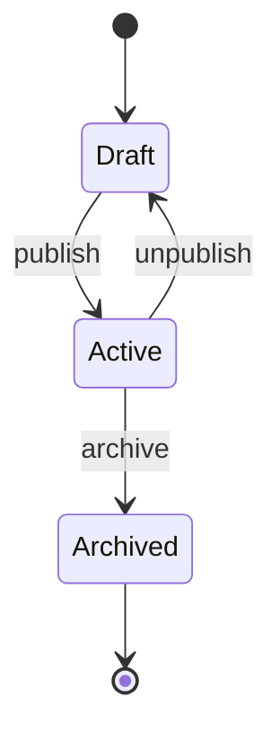

# 设计指南

agent 在做技术方案时的决策流程、产出规范和 AI 行为准则。

## 决策流程

```
接到任务
    │
    ▼
[1] 理解问题
    读任务描述、相关代码、架构文档
    确认理解 → 如果不确定，先问人
    │
    ▼
[2] 探索方案
    列出 2-3 个可行方案
    考虑：复杂度、风险、与现有架构的契合度
    │
    ▼
[3] 评估方案
    对照核心原则（docs/agents/principles.md）
    哪个方案最简单？哪个最安全？
    │
    ▼
[4] 决策 & 产出
    ▶ 小改动（tiny/small）：直接给出方案并说明理由，开始编码
    ▶ 中改动（medium）：出简要设计文档，人确认后编码
    ▶ 大改动（large）：出完整设计文档（六段结构），人确认后编码
    │
    ▼
[5] 实现 & 验证
```

## 设计文档结构

medium 及以上规模的设计文档，必须包含以下六段。每段回答一个具体问题，确保读到的人知道该写什么代码。

### 1. 用例

对齐业务需求，描述谁在什么场景下做什么：

- **参与者**：谁触发这个用例（用户、外部系统、定时任务）
- **场景**：在什么条件下发生（前置条件）
- **主路径**：正常流程——参与者做了什么，系统怎么回应，一步步写清楚
- **异常路径**：失败了会怎样、超时了会怎样、权限不够会怎样

### 2. 边界

- **输入**：需要哪些数据、配置、外部信号
- **输出**：产物是什么、谁在什么条件下拿到什么结果
- **不改的范围**：明确哪些不做，避免 scope creep

### 3. 实体

从用例中提取关键实体，按以下格式描述：

- **实体名**：概念名称（如 User、Order、Payment）
- **属性**：
  - 属性名
  - 属性类型（概念类型，不绑定具体存储：`string`、`number`、`datetime`、`enum`、`embedded object` 等）
  - 属性含义（一句话）
  - 属性约束（必填、唯一、范围、枚举值、引用其他实体等）
- **方法**：实体自身的行为（如 `订单.创建()`、`用户.修改密码()`），描述签名和执行效果
- **关系**：实体之间如何关联（关联、聚合、组合、依赖）
- **状态机**：实体有哪些状态、什么事件触发状态转移，用 `stateDiagram-v2` 表达

### 4. 流转

数据或控制流如何在组件间移动，用 `sequenceDiagram` 表达关键路径：

- 一次完整的请求/事件从入口到出口经过了哪些步骤
- 每个步骤的输入和输出
- 异常路径的分流

### 5. 接口

- 对外暴露的函数签名、API 端点、事件定义
- 输入参数的约束和校验规则
- 返回值的结构（成功和失败两种情况）
- 如果有破坏性变更，标注旧接口的处理方式

### 6. 变更

- **影响的现有模块**：哪些文件/模块被改动
- **数据迁移**：Schema 变更、数据回填、配置更新
- **部署顺序**：是否有先后依赖（先改这个，再改那个）

### 7. 风险

- **最差会怎么失败**：最坏场景推演
- **缓解措施**：针对每个风险的对策
- **回滚方案**：出了问题怎么退回去

## 图表规范

所有设计图使用 **Mermaid** 格式：

- 状态机 → `stateDiagram-v2`
- 数据/控制流转 → `sequenceDiagram`
- 系统拓扑/模块关系 → `graph TD`



## 文件放置

设计文档放在 `docs/designs/` 目录下，文件名格式：`YYYY-MM-DD-<简述>.md`。

```
docs/designs/
└── 2025-01-15-user-auth-flow.md
```

## 方案对比（仅 medium 以上）

在进入六段设计之前，先用简要表格锁定方案选择：

| 方案 | 思路 | 优点 | 缺点 | 复杂度 | 风险 |
| --- | --- | --- | --- | --- | --- |
| A | ... | ... | ... | 低/中/高 | 低/中/高 |
| B | ... | ... | ... | 低/中/高 | 低/中/高 |

**推荐方案 X**，理由。废弃的方案需记录为什么淘汰。

## AI 行为准则

1. **探索阶段给出选项**：进入脑暴或设计探索时，不止一个方案，说明 trade-off；明确的 tiny/fix 任务不强行凑方案
2. **标注信心等级**：✅ 确定 / 🤔 有把握 / ❓ 猜测
3. **引用原则**：说明方案如何符合 `docs/agents/principles.md` 中的原则
4. **主动暴露风险**：不等 reviewer 来问
5. **不确定就问**：宁愿多问一句，不要贸然假设

> 💡 方案探索阶段先做脑暴（参考 `docs/agents/brainstorm.md`），收敛后再进设计。
